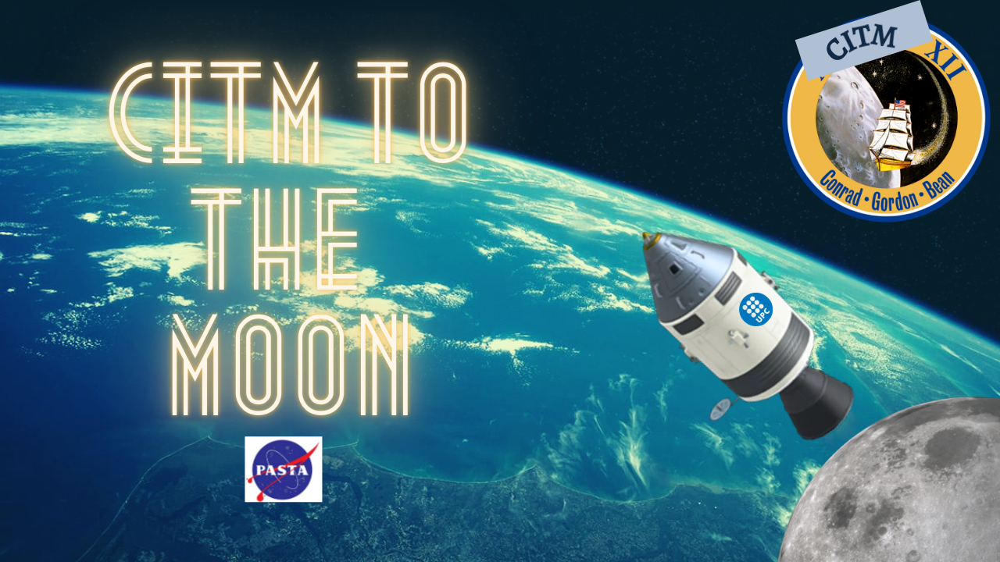

# Project Apollo

## Description

We are three 2nd year students at CITM University in Barcelona studiying videogame development. We were asked to develop a space game emulating the Apollo Mision:The objective is to launch a spaceship from earth, land safely on the moon and return to the earth without any problem. We decided to give it our little touch so we added some extra features!

We used SDL libraries to achieve this.

## Screenshot

## Objective

The main objective of this game is to travel to the Moon, grab the supply crate and arrive back to Earth safe and sound.A friendly reminder, you can not complete your mission if you do not grab that crate, we need it for our secret experiments... Be careful, we have no insurance if you crash!

## Key Features

 - Collision system with both wide and narrow phase.
 - This collisions also work with concave and convex poligons.
 - A whole Rigid Body system developed by us.
 - A world Gravity system, having all the bodies in game follow the Newton's law of universal gravitation.
 - A drag force applied on the atmosphere of the planet.
 - An elastic force used when conjoining the spaceship and the crate on the moon.
 - The spaceship works with a battery and solar panels, so it recharges over time (go green!).
 - Planet and rocket animations.
 - A beautiful space inspired tune.
 
## Controls

 - **W** - Impulse the spaceship forward.
 - **A** - steer right.
 - **D** - steer left.

## Developers

 - [Aitor Álvarez](https://github.com/AitorAlvarez17) - Developer, tester.
 - [Oscar Cuatrecasas](https://github.com/OCA99)- Developer, tester.
 - [Telmo Beroiz](https://github.com/Telmiyo) - Developer, design.
 
## [Github Repository](https://github.com/OCA99/Physics-Apolo)

## License

This project is licensed under an unmodified MIT license, which is an OSI-certified license that allows static linking with closed source software. Check LICENSE for further details.

[SDL License](https://www.libsdl.org/license.php)

[BULLET License](https://opensource.org/licenses/Zlib)

[OPENGL License](https://www.opengl.org/about/#11)

Don tell anybody, but the crate is full of szechuan sauce. We selected the best pilot for the job of course. 
